# Итоговая работа по блоку специализация

# Ход выполнения

## Linux

### Задание 1 
Используя команду cat в терминале операционной системы Linux, создать два файла Домашние животные (заполнив файл собаками, кошками, хомяками) и Вьючные животными заполнив файл Лошадьми, верблюдами и ослы), а затем объединить их. Просмотреть содержимое созданного файла. Переименовать файл, дав ему новое имя (Друзья человека).

Создание файлов

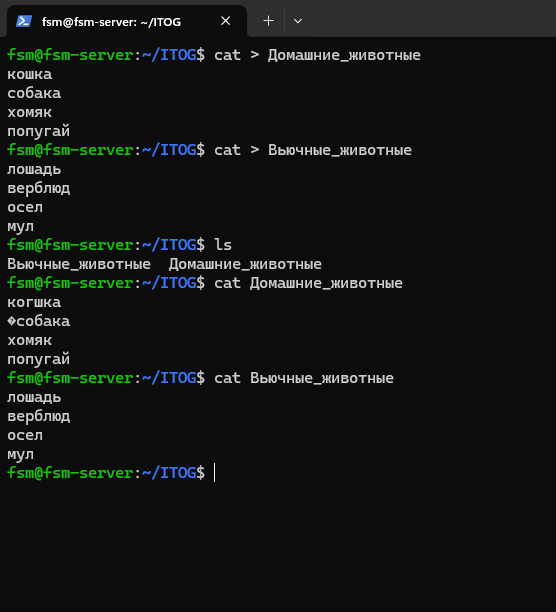

Объединение, переименование файлов

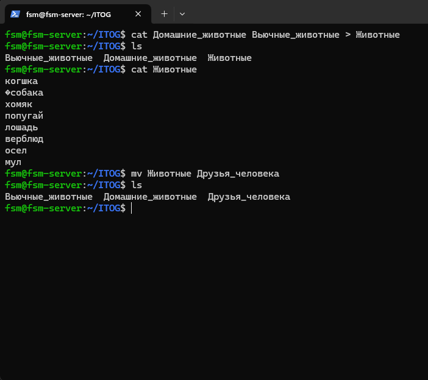

### Задание 2

Создать директорию, переместить файл туда. 

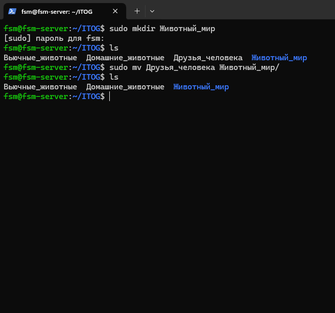

### Задание 3 

Подключить дополнительный репозиторий MySQL. Установить любой пакет из этого репозитория.

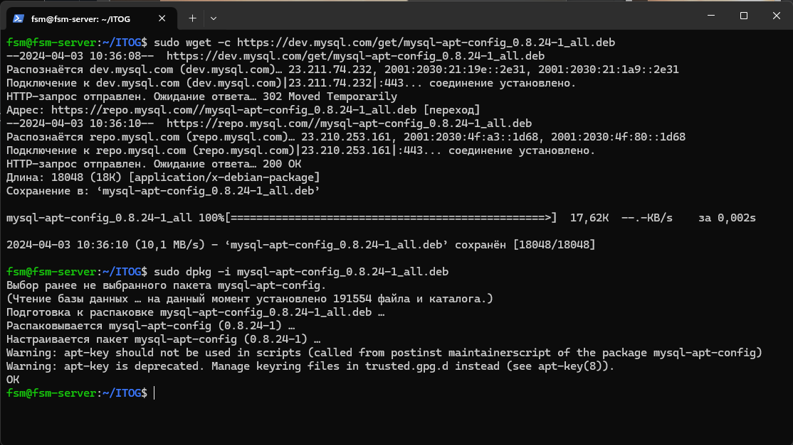

### Задание 4

Установить и удалить deb-пакет с помощью dpkg. 


### Задание 5

Выложить историю команд в терминале ubuntu

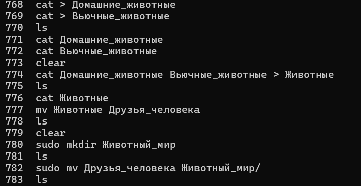

### Задание 6 

Нарисовать диаграмму, в которой есть класс родительский класс, домашние
животные и вьючные животные, в составы которых в случае домашних
животных войдут классы: собаки, кошки, хомяки, а в класс вьючные животные
войдут: Лошади, верблюды и ослы).

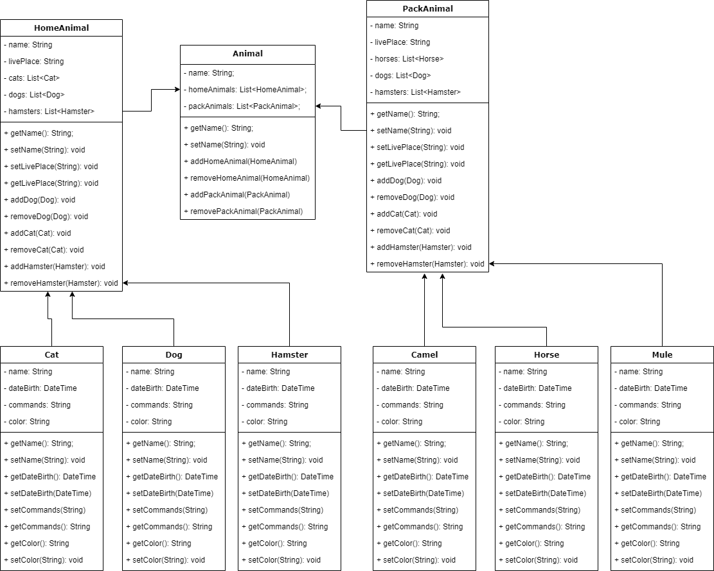

### Задание 6

В подключенном MySQL репозитории создать базу данных “Друзья
человека”

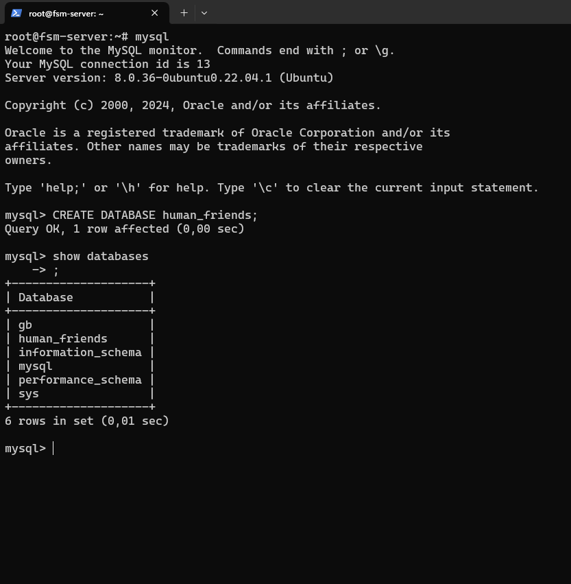
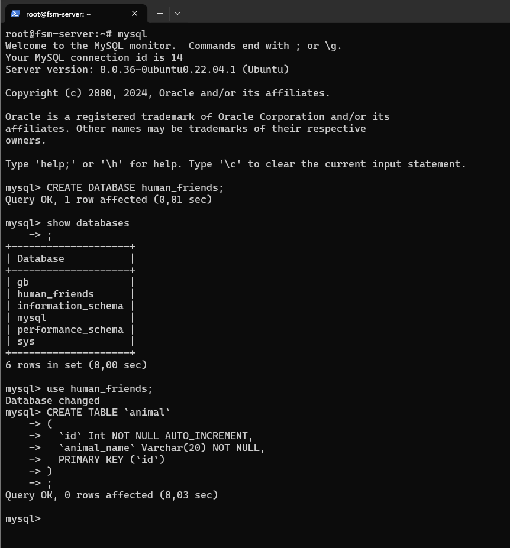


### Задание 8

Создать таблицы с иерархией из диаграммы в БД
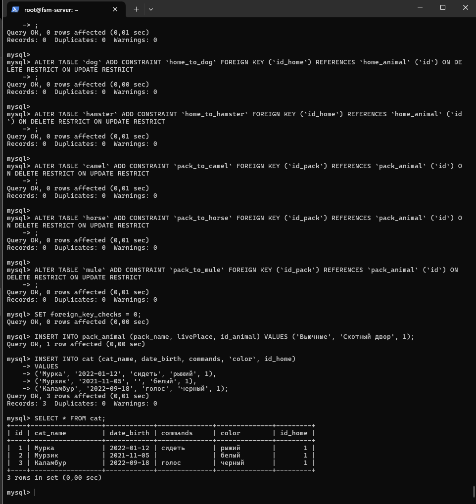

<a href="data/Animals.SQL" target="_blank">SQL дамп создания БД</a>.

### Задание 9

Заполнить низкоуровневые таблицы именами(животных), командами
которые они выполняют и датами рождения

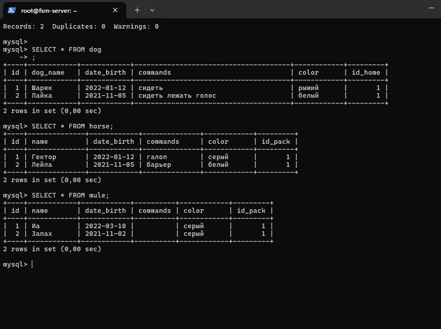


### Задание 10

Удалить из таблицы верблюдов, т.к. верблюдов решили перевезти в другой
питомник на зимовку. 

```sql
DELETE FROM camel;
```

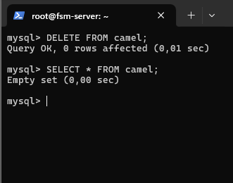


Объединить таблицы лошади, и ослы в одну таблицу.

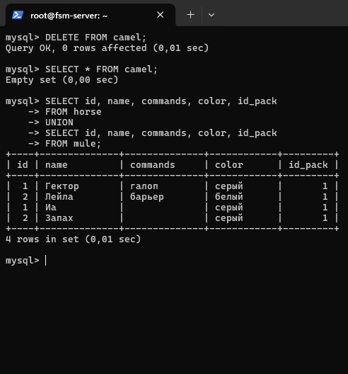

### Задача 11

Создать новую таблицу “молодые животные” в которую попадут все
животные старше 1 года, но младше 3 лет и в отдельном столбце с точностью
до месяца подсчитать возраст животных в новой таблице

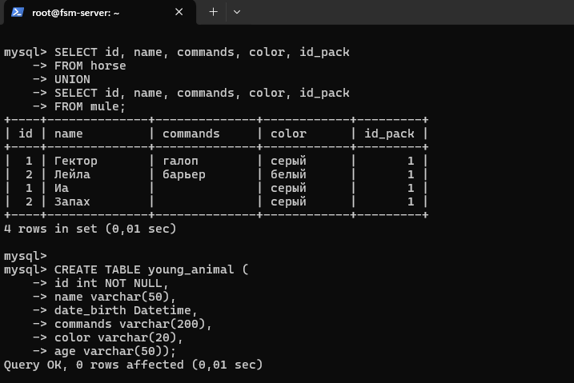

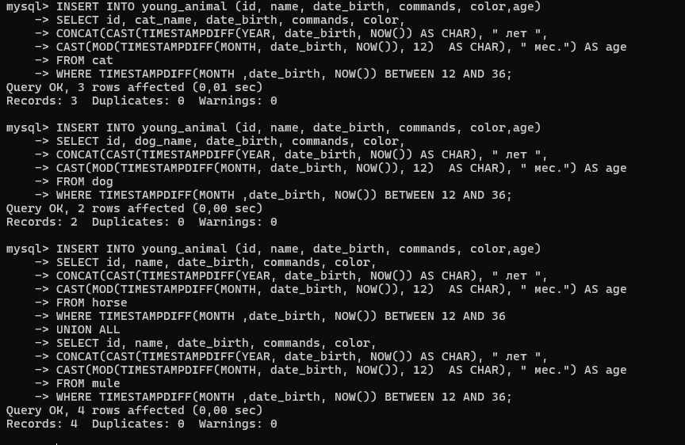

!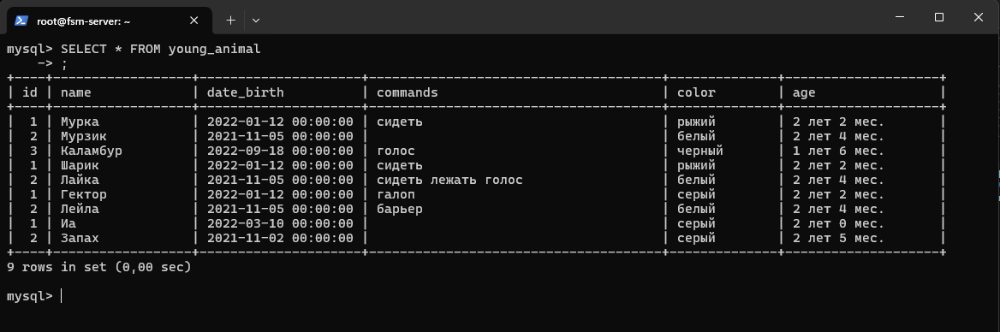

### Задача 12

Объединить все таблицы в одну, при этом сохраняя поля, указывающие на
прошлую принадлежность к старым таблицам.

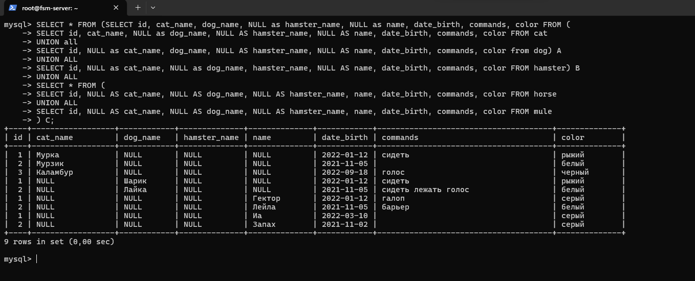
